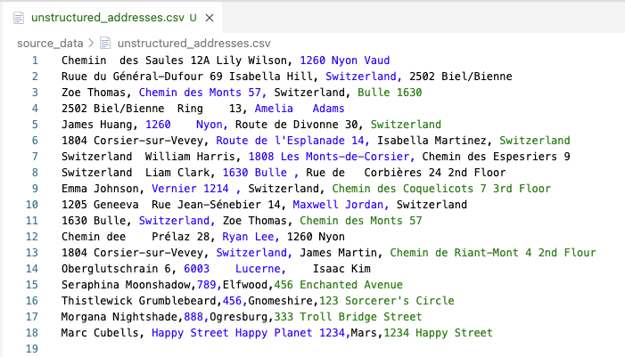
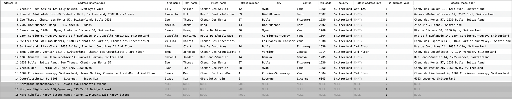
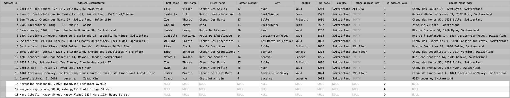
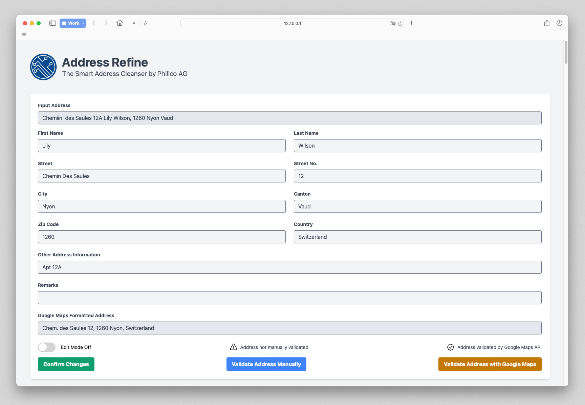
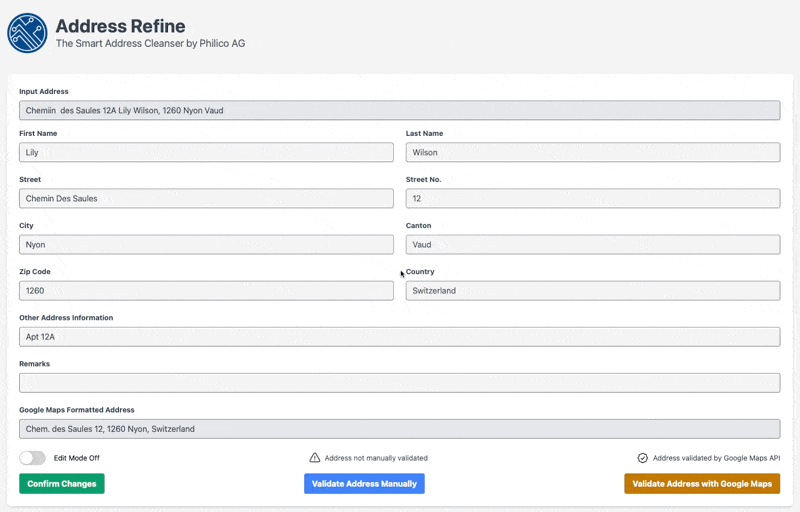
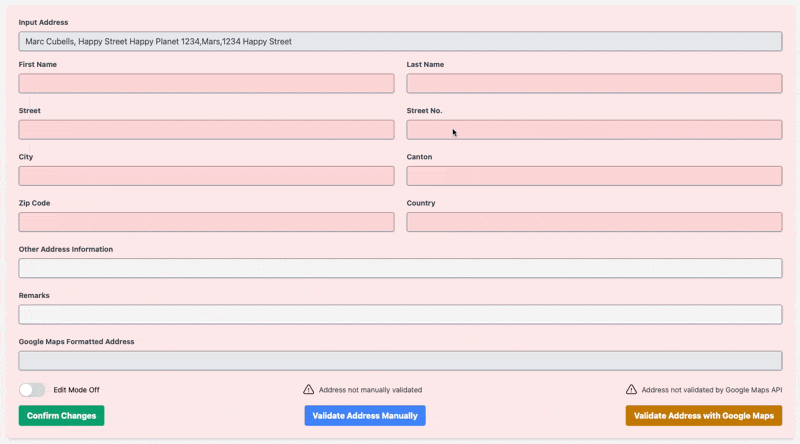

INTRO TBC

## Development with SQLite, LangChain and Flask

In developing this prototype we used Python, due to its efficacy in building complex applications with relative ease. Python's rich ecosystem facilitated the integration of three crucial libraries: [**SQLite**](https://www.sqlite.org/index.html), [**LangChain**](https://www.langchain.com) and [**Flask**](https://flask.palletsprojects.com/en/3.0.x/).

### What is SQLite?

TBC

### What is LangChain?

[**LangChain**](https://www.langchain.com) is a versatile open-source framework designed to build applications powered by large language models (LLMs). Our chatbot utilizes an LLM as a reasoning engine, which, in LangChain terminology, is referred to as an [**Agent**](https://python.langchain.com/docs/modules/agents/). This Agent is responsible for planning and executing actions based on user input.

For a deeper dive into how [**LangChain**](https://www.langchain.com) can be used to simplify the prototyping of AI applications, visit our blog post: [**AI Prototyping with LangChain and Streamlit**](https://philico-tech.github.io/ptech-blog/langchain/).

### What is Flask?

TBC

## The data Workflow

## The application in detail

The following screenshot shows the unstructured data

The following screenshot shows the parsed data and the address that are validated by the Google Maps API are highlighted

The following screenshot shows the parsed data and the address not validated by the Google Maps API are highlighted

The following screenshot shows the front end

The following GIF shows ...

The following GIF shows ...

## Conclusion

TBC
