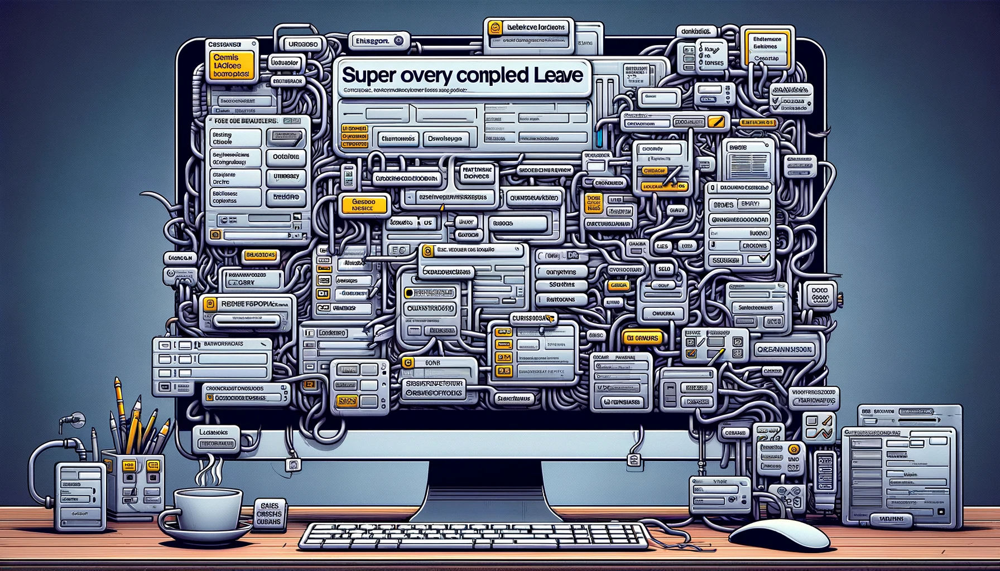
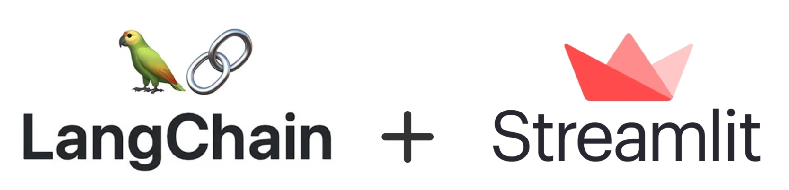

In today’s fast-paced corporate world, managing leave requests can often become a cumbersome task, both for employees and HR departments. The traditional process, typically involving navigating through complex platforms and tediously filling out numerous fields one by one, can be time-consuming and frustrating. This not only hampers productivity but also adds an unnecessary layer of administrative complexity.

Recognizing these challenges, we've embarked on an journey to transform how leave requests are managed. Leveraging the power of AI, we have developed a chatbot prototype designed to simplify the leave application process, making it more user-friendly, efficient, and accessible for everyone.

Imagine a system where, instead of navigating through a complex labyrinth of forms and fields, you can interact with a chat interface that effortlessly handles your leave requests. This AI-powered assistant is capable of not only submitting new leave requests for you but also offers a comprehensive overview of your leave history. It keeps you informed about your remaining vacation days and advises on the number of days needed to cover a specific vacation period. All of these features, and more, are seamlessly integrated, thanks to the advanced capabilities of AI.

## Crafting a Chatbot with LangChain and Streamlit

In developing this prototype, we utilized Python, due to its efficacy in building complex applications with relative ease. Python's robust ecosystem enabled us to integrate two pivotal libraries: [**LangChain**](https://www.langchain.com) and [**Streamlit**](https://streamlit.io). 

[**LangChain**](https://www.langchain.com), an open-source development framework available for Python and JavaScript, offers a seamless way to integrate large language models into applications. On the other hand, [**Streamlit**](https://streamlit.io), is an intuitive framework for creating interactive web applications with minimal effort. 

If you are interested in learning more about these libraries, check out the post we published on our blog: [**AI Prototyping with LangChain and Streamlit**](https://www.langchain.com/blog/ai-prototyping-with-langchain-and-streamlit/).
