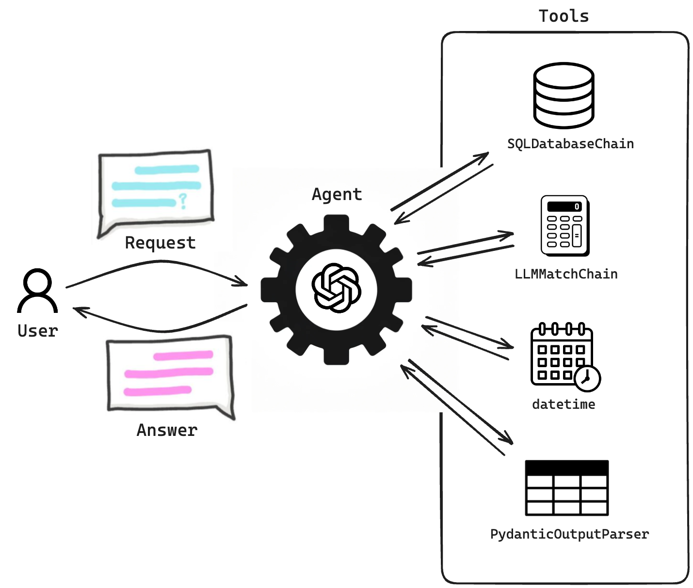
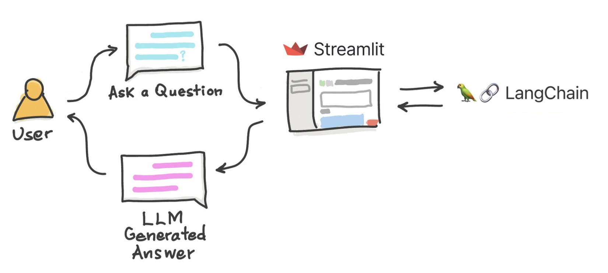

We set out to run an experiment to see if we could use Large Language Models (LLMs) to create a leave request tool with a chatbot interface that’s actually nice to use. Normally, these kinds of tools rely on classic forms, and let's face it – the user experience is often not great.

We also wanted this AI-powered chatbot to do more than just submit leave requests. The idea was to have it give you a full picture of your leave history too – kind of like having your own personal leave management assistant.

## Development with LangChain and Streamlit

In developing this prototype we used Python, due to its efficacy in building complex applications with relative ease. Python's rich ecosystem facilitated the integration of two crucial libraries: [**LangChain**](https://www.langchain.com) and [**Streamlit**](https://streamlit.io), each playing a pivotal role in our project.

### What is LangChain?

[**LangChain**](https://www.langchain.com) is a versatile open-source framework designed to build applications powered by large language models (LLMs). Our chatbot utilizes an LLM as a reasoning engine, which, in LangChain terminology, is referred to as an [**Agent**](https://python.langchain.com/docs/modules/agents/). This Agent is responsible for planning and executing actions based on user input.

The LangChain Agent operates through a structured process:

1. **Input Reception**: Receiving natural language input from users.

2. **Processing with LLM**: Utilizing the LLM to analyze the input and develop an action plan.

3. **Plan Execution**: Implementing the action plan, potentially involving external tools.

4. **Output Delivery**: Delivering the executed plan's results to the user.

The architecture of LangChain Agents includes:

- **Agent**: The central component, responsible for input processing, action plan generation, and execution.

- **Tools**: External resources that the agent utilizes to perform specific tasks, ranging from other LLMs to web APIs.

In our prototype, we made use of OpenAI LLMs [**GPT-3.5**](https://platform.openai.com/docs/models/gpt-3-5) and [**GPT-4**](https://openai.com/research/gpt-4) as the reasoning engines. We switched between the two models, depending on the task at hand, as we'll discuss later.

The agent was equipped with the following tools:

- The LangChain library [**SQLDatabaseChain**](https://api.python.langchain.com/en/latest/sql/langchain_experimental.sql.base.SQLDatabaseChain.html) for interacting with the relational database.

- The LangChain library [**LLMMathChain**](https://api.python.langchain.com/en/latest/chains/langchain.chains.llm_math.base.LLMMathChain.html#) for performing mathematical calculations.

- The LangChain library [**PydanticOutputParser**](https://python.langchain.com/docs/modules/model_io/output_parsers/pydantic) to generate JSON formatted Leave Request Proposals.

- The Python module [**datetime**](https://docs.python.org/3/library/datetime.html) for managing time and calendar-related functions.

The following diagram illustrates the architecture of our prototype:

### What is Streamlit?

[**Streamlit**](https://streamlit.io) is an intuitive framework designed for creating interactive web applications effortlessly. Its standout feature is the collection of ready-to-use components, which simplifies the development of user-friendly interfaces, making the process of building interactive elements straightforward and efficient. We made use of Streamlit to create the chat interface.

For a deeper dive into how [**LangChain**](https://www.langchain.com) and [**Streamlit**](https://streamlit.io) can be used together to simplify the prototyping of AI applications, visit our blog post: [**AI Prototyping with LangChain and Streamlit**](https://philico-tech.github.io/ptech-blog/langchain/).

## The Chatbot in action

Our chatbot prototype demonstrated its ability to handle various tasks:

### Use Case #1: Submit a new leave request

Users can use natural language to describe the leave request they want to submit. In response, the chatbot will generate a tailored leave request proposal for review.

The assistant also understands generic time expressions, such as *from Tuesday to Thursday next week*, enhancing user convenience.

The interactive nature of the chatbot allows for iterative refinements to the leave request proposals, based on user feedback. In the following video, we can see how the chatbot deletes one entry from the generated proposal and then updates it according to the user's input.

Bellow, we can see how the chatbot adds a new entry to the generated proposal.

### Use Case #2: Chat with your leave request history

The chatbot is capable of retrieving leave request data stored in the database, helping the employees to keep track of their leave history and plan future requests accordingly.

The chatbot can also inform the user about their remaining vacation days.

It will also calculate the number of days needed to cover a specific period, as shown below.

As can be seen in the videos above, we chose OpenAI’s **GPT-4** for this use case. We found that GPT-3.5, while sometimes capable, lacked consistent reliability in translating natural language to SQL queries. **GPT-4**, in contrast, excelled in this aspect, ensuring accurate data retrieval from the database.

However, it's important to acknowledge the trade-offs that come with using **GPT-4**. The most notable among these is the higher cost. **GPT-4** comes with a steeper price tag compared to its predecessors. Additionally, while it's more accurate and sophisticated, it's also a slower when processing queries. This means that while we gain in terms of precision and versatility, we do compromise somewhat on speed and budget. Balancing these factors is a key consideration in the decision-making process.

## Limitations and potential improvements

As previously mentioned, a big limitation we encountered was the erratic behavior of OpenAI's LLM Model GPT-3.5 in translating plain English into SQL queries. This inconsistency forced us to switch to **GPT-4** for this particular use case.

While **GPT-4** proves more accurate overall, it is not without its own limitations, especially when interpreting complex expressions of time, such as *Tuesday in two weeks* or *the first week of September*. In these instances, the chatbot struggled to understand the intended time periods, leading to incorrect results.

In regards to potential improvements and next steps, two main areas come to mind:

- **User authentication**: Implementing unique usernames and passwords for secure, personalized access to leave requests and confidential data is a crucial next step.

- **Full HR Chatbot**: We aim to broaden the chatbot's capabilities beyond leave requests, covering a wider spectrum of HR functions. This includes, among others, instant access to HR policies, overtime compensation details, and assisted timesheet submission.

## Conclusion

Developing this AI-powered leave management chatbot has been a journey of discovery and innovation, revealing AI's immense potential in simplifying complex tasks. The project highlighted the need for adaptability and continuous improvement in the rapidly evolving AI landscape. As we look forward, we're excited to further refine our chatbot, pushing the limits of AI's capabilities in the workplace.
